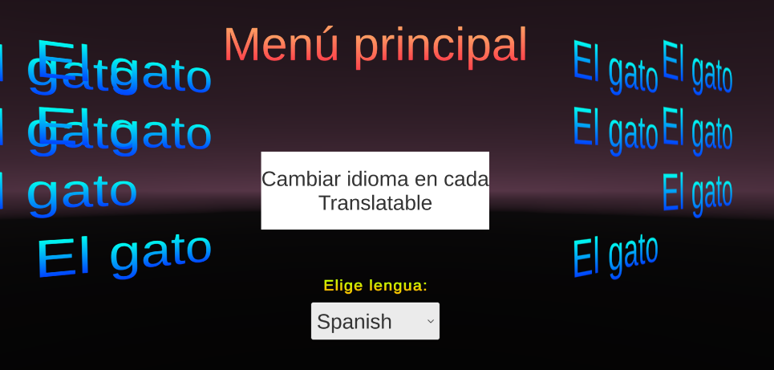

# Lightweight library that allows easily change language using ScriptableObject.

## Prerequisites: TextMeshPro and Unity

Consists of 3 (2 runtime and 1 editor) scripts:
1. Translatable.cs       (MonoBehaviour)
2. TranslatableText.cs   (ScriptableObject)
3. TranslatableEditor.cs (Editor)

## Launch a demo scene "TranslatableSampleScene".

### Usage:
* Add *Translatable* on *GameObject* that has either *TextMeshProUGUI* or *TextMeshPro* component 
* To add new language: add new enum to *Language* that located in *Translatable.cs*
* To change language via code call static function Translatable.SetLanguageAndUpdateAll(Language xxx)

### This lib was made on Unity 2020.